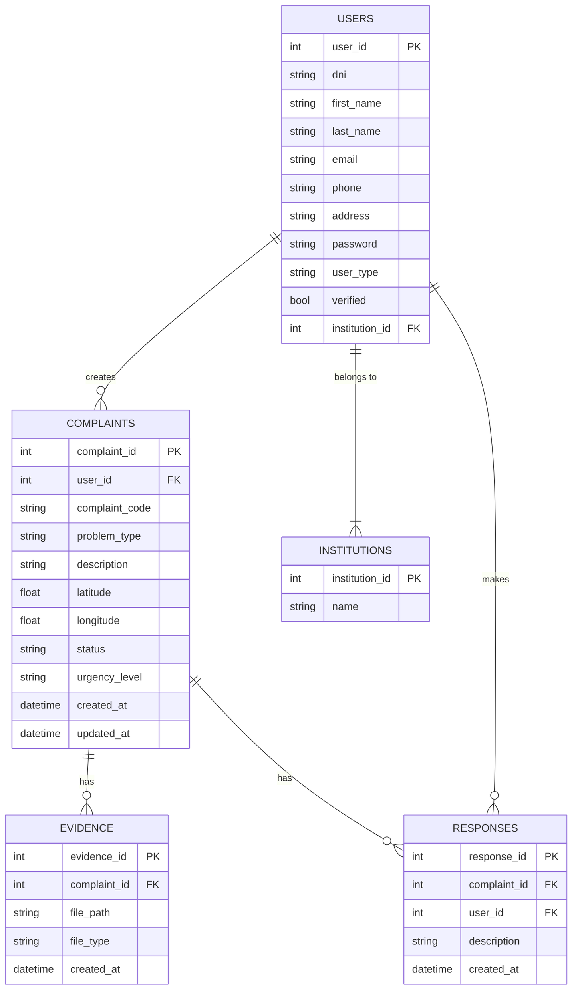

```mermaid
erDiagram
    USERS ||--o{ COMPLAINTS : "creates"
    USERS {
        int user_id PK
        string dni
        string first_name
        string last_name
        string email
        string phone
        string address
        string password
        string user_type
        bool verified
        int institution_id FK
    }
    INSTITUTIONS {
        int institution_id PK
        string name
    }
    COMPLAINTS {
        int complaint_id PK
        int user_id FK
        string complaint_code
        string problem_type
        string description
        float latitude
        float longitude
        string status
        string urgency_level
        datetime created_at
        datetime updated_at
    }
    EVIDENCE {
        int evidence_id PK
        int complaint_id FK
        string file_path
        string file_type
        datetime created_at
    }
    RESPONSES {
        int response_id PK
        int complaint_id FK
        int user_id FK
        string description
        datetime created_at
    }

    USERS ||--|{ INSTITUTIONS : "belongs to"
    COMPLAINTS ||--o{ EVIDENCE : "has"
    COMPLAINTS ||--o{ RESPONSES : "has"
    USERS ||--o{ RESPONSES : "makes"
```
